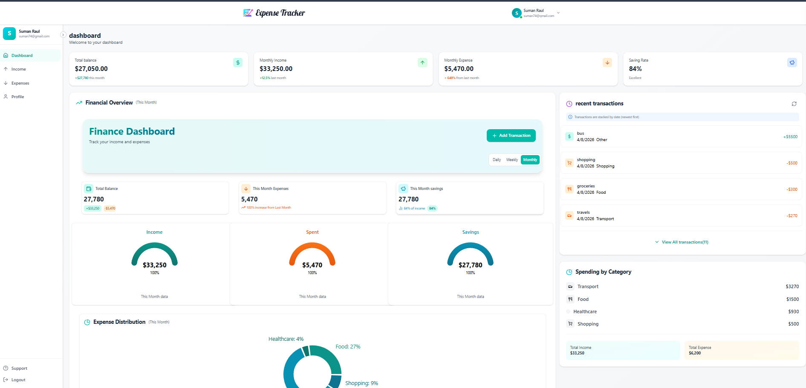
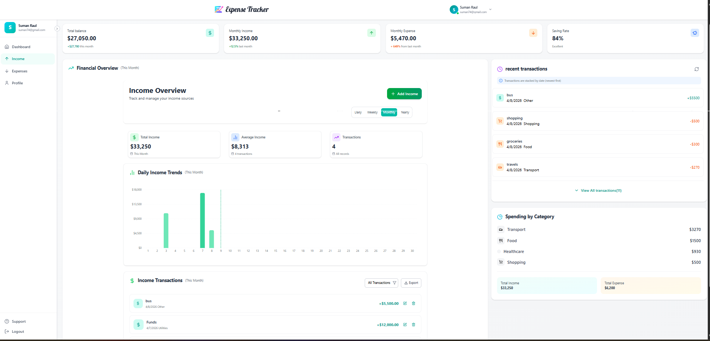
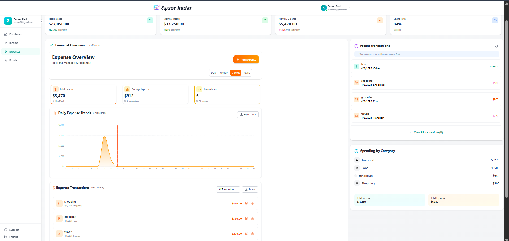
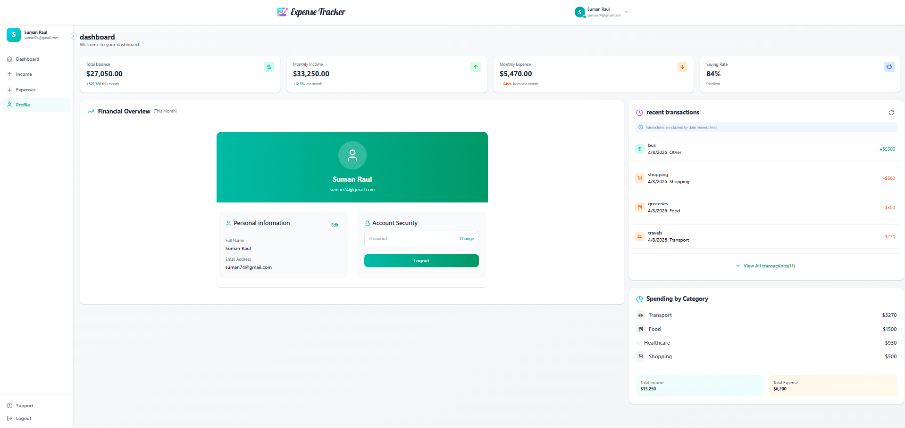

# 💸 Expense Tracker

A full-stack **Expense Tracker Web App** to manage your income, expenses, and savings efficiently.  
Built with modern technologies like **React, Node.js, Express, and MongoDB**.

---

## 🚀 Live Features

✨ Clean & modern dashboard UI  
🔐 Secure authentication (JWT)  
📊 Real-time income & expense tracking  
📈 Financial analytics & charts  
👤 Profile management  
🧾 Transaction history  
📂 Category-based expense tracking  

---

## 🖼️ Screenshots

### 📊 Dashboard
 

### 💰 Income Page
 

### 💸 Expense Page
 

### 👤 Profile Page
 

---

## 🛠️ Tech Stack

### 🔹 Frontend
- React.js
- React Router DOM
- Axios
- Tailwind CSS
- Recharts

### 🔹 Backend
- Node.js
- Express.js
- MongoDB
- JWT Authentication

---

## 📂 Project Structure
Expense-Tracker/
│
├── client/ # React frontend
├── server/ # Node backend
├── screenshots/ # Project images
└── README.md


---

## ⚙️ Installation & Setup

### 1️⃣ Clone the repository
```bash
git clone https://github.com/Suman-20/Expense-Tracker.git
cd expense-tracker

2️⃣ Setup Backend
cd server
npm install
npm start

2️⃣ Setup Backend
cd server
npm install
npm run dev


🔐 Authentication Flow

User login/signup
JWT token stored in localStorage
Protected routes
Token-based API requests


📊 Features Breakdown

📌 Add / Edit / Delete transactions
📌 Monthly income & expense tracking
📌 Savings calculation
📌 Category-wise analytics
📌 Interactive charts